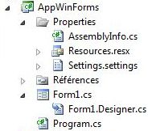
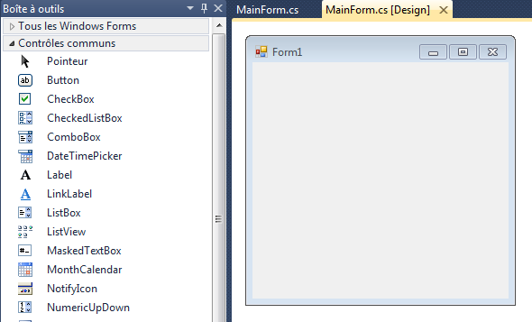

# La technologie WinForms

L'objectif de ce chapitre est d'appréhender le fonctionnement de la technologie Microsoft WinForms.

## Introduction

WinForms (abréviation de Windows Forms) est une plate-forme de création d'interfaces graphiques créée par Microsoft. Elle est adossée au framework .NET et peut être déployée sur des environnements de bureau ou mobiles.

Cette technologie suit le paradigme de programmation évènementielle : une application WinForms est pilotée par des évènements auxquels elle réagit.

## Structure d'une application WinForms

Une application WinForms est structurée autour d'un ou plusieurs formulaires, appelés **forms**.

Lorsqu'on crée une nouvelle application WinForms, l'IDE Visual Studio génère automatiquement plusieurs éléments qu'il est important d'identifier.



Les fichiers du répertoire `Properties` sont gérés par Visual Studio. Il ne doivent pas être édités manuellement.

Etudions en détail le reste de l'arborescence

### Programme principal

Le fichier `Program.cs` correspond au point d'entrée dans l'application. Voici son contenu par défaut.

```csharp
static void Main()
{
    Application.EnableVisualStyles();
    Application.SetCompatibleTextRenderingDefault(false);
    Application.Run(new Form1());
}
```

Comme pour une application console, la méthode statique `Main` est le point d'entrée dans le programme. Cette méthode crée (`new Form1()`) puis affiche le premier formulaire de l'application.

### Anatomie d'un formulaire

Chaque formulaire WinForms est décrit par deux fichiers :

* Un fichier `.Designer.cs` qui contient le code généré automatiquement par l'IDE lors de la conception graphique du formulaire. 
* Un fichier `.cs` qui contient le code C# écrit par le développeur pour faire réagir le formulaire aux évènements qui se produisent. Ce fichier est appelé "*code behind*".

**CONSEIL** : après chaque création de formulaire, une bonne pratique consiste à lui donner immédiatement un nom plus parlant, par exemple `MainForm` pour le formulaire principal. Pour cela, faites un clid droit sur le formulaire dans l'arborescence, puis choisissez **Renommer**.

Le fichier "code behind" `.cs` associé à un formulaire est accessible par clic droit sur le formulaire puis **Afficher le code**, ou à l'aide du raccourci clavier **F7**. Voici son contenu initial.

```csharp
public partial class MainForm : Form
{
    public MainForm()
    {
        InitializeComponent();
    }
}
```

Il s'agit de la définition d'une classe avec son constructeur. On remarque la présence du mot-clé `partial`. Il indique que seul une partie du code de la classe est présent dans ce fichier. Le reste se trouve, comme vous l'avez deviné, dans le fichier `.Designer.cs`.

## Edition graphique d'un formulaire

Un double-clic sur le formulaire dans l'arborescence déclenche l'apparition du concepteur de formulaire. Cette interface va permettre d'éditer l'apparence du formulaire. Nous en reparlerons plus loin.



TODO

## Gestion des évènements

TODO