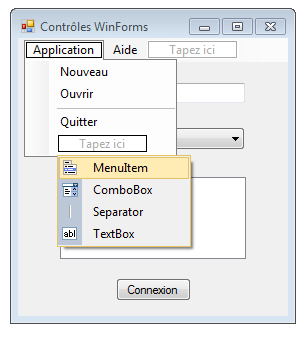

# Principaux contrôles WinForms

L'objectif de ce chapitre est de présenter succinctement quelques contrôles WinForms parmi les plus utilisés.

> D'autres contrôles plus spécialisés seront présentés plus loin.

## Nommage des contrôles

Comme indiqué précédemment, il est fortement recommandé de donner un nom parlant à un contrôle immédiatement après son ajout au formulaire. Cela augmente fortement la lisibilité du code utilisant ce contrôle.

On peut aller plus loin et choisir une convention de nommage qui permet d'identifier clairement le type du contrôle. Il n'existe pas de consensus à ce sujet : 

* On peut rester générique et suffixer tous les contrôles par `Ctrl`.
* On peut choisir un suffixe différent pour chaque type de contrôle.

L'important est de rester cohérent dans la convention choisie afin que le code soit uniforme.

## Affichage de texte

Le contrôle **Label** est dédié à l'affichage d'un texte *non modifiable*. 

> On peut donner à un contrôle de ce type un nom finissant par `Lbl`. Exemple : `loginLbl`.

Il dispose d'une propriété **Text** qui permet de récupérer ou de définir le texte affiché par le contrôle.

## Saisie de texte

Le contrôle **TextBox** crée une zone de saisie de texte. 

> On peut donner à un contrôle de ce type un nom finissant par `TB`. Exemple : `loginTB`.

Voici ses propriétés importantes :

* **Text** permet de récupérer ou de définir la valeur saisie.
* **Multiline** précise si le texte saisi peut comporter une ou plusieurs lignes.
* **Enabled** permet, quand elle vaut `true`, d'en faire une zone en lecture seule (saisie impossible).

> Le contrôle **RichTextBox** est une version enrichie de ce contrôle.

## Liste déroulante

Le contrôle **ComboBox** définit une liste déroulante. 

> On peut donner à un contrôle de ce type un nom finissant par `CB`. Exemple : `countryCB`.

Voici ses propriétés importantes :
* **Items** regroupe ses valeurs sous la forme d'une liste (collection) d'objets. On peut ajouter des valeurs dans la liste déroulante dans le concepteur du formulaire ou via le code.
* **DropDownStyle** permet de choisir le style de la liste. Pour obtenir des valeurs non éditables par l'utilisateur, il faut choisir le style `DropDownList`. 
* **SelectedIndex** récupère ou définit l'indice de l'élément actuellement sélectionné. Le premier élément correspond à l'indice 0.
* **SelectedItem** renvoit l'élément actuellement sélectionné sous la forme d'un objet.

```csharp
// Ajoute 3 pays à la liste
countryCB.Items.Add("France");
countryCB.Items.Add("Belgique");
countryCB.Items.Add("Suisse");

// Sélectionne le 2ème élément de la liste
countryCB.SelectedIndex = 1;
```

L'évènement **SelectedIndexChanged** permet de gérer le changement de la valeur sélectionnée de la liste.

```csharp
// Gère le changement de sélection dans la liste déroulante
private void countryCB_SelectedIndexChanged(object sender, EventArgs e)
{
    // On caste l'objet renvoyé par SelectedItem vers le type chaîne
    string selectedValue = (string) countryCB.SelectedItem;
    // ...
}
```

## Liste d'éléments

Le contrôle **ListBox** permet de créer une liste d'éléments.

> On peut donner à un contrôle de ce type un nom finissant par `LB`. Exemple : `hardwareLB`.

Voici ses propriétés importantes :
* **Items** regroupe ses valeurs sous la forme d'une liste (collection) d'objets. On peut ajouter des valeurs dans la liste déroulante dans le concepteur du formulaire ou via le code.
* **SelectionMode** permet de choisir si la liste est à sélection simple, multiple ou si la sélection est désactivée.
* **SelectedIndex** récupère ou définit l'indice de l'élément actuellement sélectionné. Le premier élément correspond à l'indice 0.
* **SelectedItems** renvoit les éléments actuellement sélectionnés sous la forme d'une liste d'objets.

```csharp
// Ajoute 4 éléments à la liste
hardwareLB.Items.Add("PC");
hardwareLB.Items.Add("Mac");
hardwareLB.Items.Add("Tablette");
hardwareLB.Items.Add("Smartphone");

// Sélectionner le 1er élément
hardwareLB.SelectedIndex = 0;
```

L'évènement **SelectedIndexChanged** permet de gérer le changement de sélection dans la liste.

```csharp
// Gère le changement de sélection dans la liste
private void hardwareLB_SelectedIndexChanged(object sender, EventArgs e)
{
    // Parcours de la liste des éléments sélectionnés
    foreach (string value in hardwareLB.SelectedItems)
    {
        // ...
    }
}
```

> Le contrôle **ListView** est une version enrichie de ce contrôle.

## Bouton

Le contrôle **Button** permet de créer un bouton.

> On peut donner à un contrôle de ce type un nom finissant par `Btn`. Exemple : `connectBtn`.

Voici ses propriétés importantes :
* **Text** récupère ou définit le texte affiché dans le bouton.
* **Enabled** active ou désactive le bouton (clic impossible).
* **DialogResult** définit le résultat renvoyé lors d'un clic sur le bouton quand le formulaire est affichée de manière modale (voir chapitre suivant).

L'évènement **Click** permet de gérer le clic sur le bouton.

```csharp
// Gère le clic sur le bouton de connexion
private void connectBtn_Click(object sender, EventArgs e)
{
    // ...
}
```

>Les contrôles **CheckBox** et **RadioButton** permettent respectivement de créer une case à cocher et un bouton bouton radio.

## Barre de menus

Le contrôle **MenuStrip** permet de créer une barre de menus déroulants. Une entrée de menu déroulant peut être une commande (**MenuItem**), une liste déroulante, une zone de texte ou un séparateur.



> Dans le cas d'une barre de menus, on peut conserver le nommage des contrôles initial proposé par Visual Studio.

L'évènement **Click** permet de gérer le clic sur une commande du menu déroulant.

```csharp
// Gère le clic sur la commande Quitter
private void quitterToolStripMenuItem_Click(object sender, EventArgs e)
{
    // ...
}
```